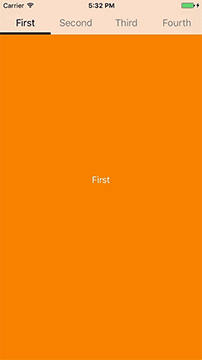
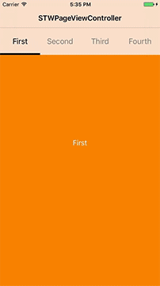
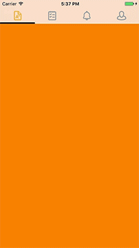
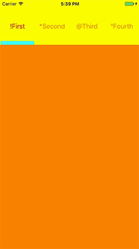

# STWPageViewController


[](https://developer.apple.com/iphone/index.action)
[](https://developer.apple.com/swift)
[](http://mit-license.org)

STWPageViewController allow to create a controllers container (UIPageViewController) quickly and easily, it is managed by a customizable toolbar. STWPageViewController can be loaded either alone or in a UINavigationController, the toolbar will automatically adapt to display needs.

<kbd>
   
</kbd>

## Installation

**CocoaPods:**

```
pod 'STWPageViewController'
```

## Usage

**Direct `Init` with `pages` as simple Controller:**

Setting sub controllers' title, will be created the items automatically

```swift
...
func application(_ application: UIApplication, didFinishLaunchingWithOptions launchOptions: [UIApplicationLaunchOptionsKey: Any]?) -> Bool {
	self.window = UIWindow(frame: UIScreen.main.bounds)
	
	let firstController = UIViewController()
	let secondController = UIViewController()

	firstController.title = "First"
	firstController.view.backgroundColor = .orange
	secondController.title = "Second"
	secondController.view.backgroundColor = .blue
	
	let pages = [firstController, secondController]
	let pageViewController = STWPageViewController(pages: pages)

	self.window?.rootViewController = pageViewController

	self.window?.makeKeyAndVisible()
}
...
```
**Add `pages` after `init` as `rootController` of `UINavigationController`:**

You can customize Tool Bar Item setting `STWPageViewControllerToolBarItem'` title, Colors or Icon

```swift
...
func application(_ application: UIApplication, didFinishLaunchingWithOptions launchOptions: [UIApplicationLaunchOptionsKey: Any]?) -> Bool {
	self.window = UIWindow(frame: UIScreen.main.bounds)
	
	let firstController = UIViewController()
	let secondController = UIViewController()

	firstController.pageViewControllerToolBarItem = STWPageViewControllerToolBarItem(title: "First", normalColor: .orange, selectedColor: .red)
	firstController.view.backgroundColor = .orange
	
	secondController.pageViewControllerToolBarItem = STWPageViewControllerToolBarItem(image: UIImage(named :"iconDefault"), selectedImage: UIImage(named :"iconSelected"))
	secondController.view.backgroundColor = .blue
	
	let pageViewController = STWPageViewController()
	let navigationController = UINavigationController(rootViewController: pageViewController)
	
	let pages = [firstController, secondController]
	pageViewController.setPages(pages: pages) 

	self.window?.rootViewController = navigationController

	self.window?.makeKeyAndVisible()
}
...
```


## Delegation

`STWPageViewController` has two methods in order to know which is the controller will be presented and which is the controller did be presented and their index in `pages`

```swift
class ViewController: STWPageViewController, STWPageViewControllerDelegate {

    override func viewDidLoad() {
        super.viewDidLoad()
        self.delegate = self
    }
    ...
    func pageControllerDidPresentPage(viewController:UIViewController, pageIndex:Int) {
        print("DidPresent: \(viewController) page:\(pageIndex)")
    }
    
    func pageControllerWillPresentPage(viewController:UIViewController, pageIndex:Int) {
        print("WillPresent: \(viewController) page:\(pageIndex)")
    }

```


## Customize

You can customize many aspects of `STWPageViewController` for all your needs

**STWPageViewController setting properties**:

* **`startPage`** Start index controller
**❕ Define `startPage` from `init`**

  ```swift
  let pageViewController = STWPageViewController(pages: pages, startPage:1)
  // default: 0
  ```

* **`toolBarHeight`** ToolBar height.
**❕ Automatic adjust for UIApplication status bar status**

  ```swift
  var toolBarHeight: CGFloat { get set }
  // default: 44 + (status bar height if needs)
  ```
  
* **`isPageControllerScrollingEnabled `** Enable horizontal scrolling page.

  ```swift
  var isPageControllerScrollingEnabled: Bool { get set }
  // default: true
  ```
 
  
**STWPageViewControllerToolBar setting properties**:

* **`indicatorBarPadding `** Offset indicator bar.

  ```swift
  var indicatorBarPadding: CGFloat { get set }
  // default: 0
  ```

* **`indicatorBarHeight `** Indicator bar height.

  ```swift
  var indicatorBarHeight: CGFloat { get set }
  // default: 4
  ```

* **`indicatorBarTintColor `** Indicator bar color.

  ```swift
  var indicatorBarTintColor: UIColor { get set }
  // default: .black
  ```
  
  
**STWPageViewController getting properties**:

* **`currentIndexPage`** Current visible controller index.

  ```swift
  var currentIndexPage: Int { get }
  ```
  
* **`visibleViewController`** Current visible controller.

  ```swift
  var visibleViewController: UIViewController? { get }
  ```
  
**STWPageViewController public methods**:

* **`gotoPage(_ index:Int?, animated:Bool)`** Scrolls STWPageViewController at specific index.

  ```swift
  func gotoPage(_ index:Int?, animated:Bool)
  ```
  
## Requirements
This pod requires a deployment target of iOS 9.0 or greater

## Author

[@Steewitter](https://twitter.com/Steewitter), [me@steewe.com](mailto:me@steewe.com)

## License

STWPageViewController is available under the MIT license. See the LICENSE file for more info.